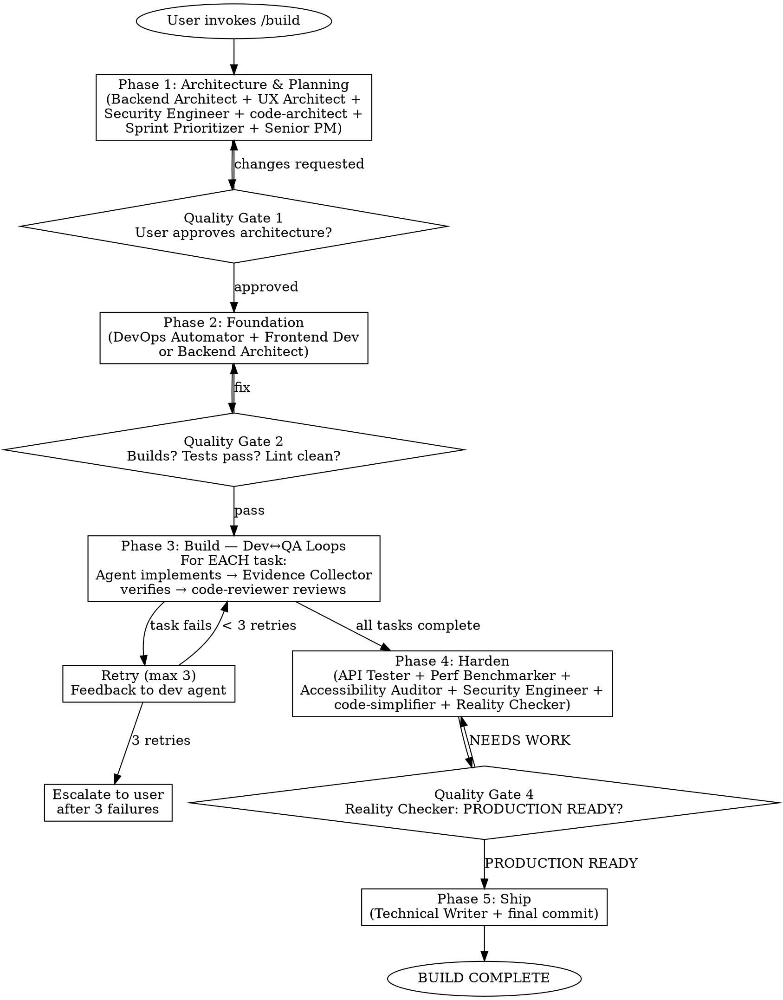

# /build — NEXUS-Sprint Pipeline

## PROCESS INTEGRITY — READ THIS FIRST

<HARD-GATE>
You are an ORCHESTRATOR. You coordinate specialist agents. You do NOT write implementation code yourself.

If you are about to write implementation code directly — STOP. That is a violation of this process. Dispatch to a specialist agent instead.

This gate is non-negotiable. No exceptions. No "just this one quick fix." No "it's faster if I do it myself."
</HARD-GATE>

**Resuming after context compaction?** If your context was recently compacted or you are continuing a previous session:
1. Read `docs/plans/.build-state.md` to recover your phase, step, and progress
2. Re-read THIS file completely — you are reading it now
3. Check the TodoWrite list for task progress
4. Resume from the saved state, not from scratch
5. Do NOT skip ahead or fall back to default coding behavior

### Rationalization Prevention

If you catch yourself thinking any of these, you are drifting from the process:

| Thought | Reality |
|---------|---------|
| "It's faster if I just write this myself" | You are an orchestrator. Dispatch to an agent. Speed is not your job — coordination is. |
| "This is too small for a subagent" | Every implementation task goes through an agent. No exceptions. Small tasks still need the Dev→QA loop. |
| "I'll skip the code review for this one" | Every task gets reviewed. The code-reviewer agent exists for a reason. |
| "The quality gate is obvious, I'll just proceed" | Present it to the user. Quality gates require explicit user approval. |
| "I already know what to build, I'll skip architecture" | Phase 1 is mandatory. The architecture step catches design mistakes before they become code. |
| "Tests aren't needed for this part" | Every task has acceptance criteria and tests. The Evidence Collector verifies. |
| "I'll clean this up later" | The Harden phase (Phase 4) exists for this. Don't skip steps — follow the process. |
| "Context was compacted, I'll just keep coding" | STOP. Re-read this file. Check .build-state.md. Reload the process. |

### Process Flowchart



---

You are the **Agents Orchestrator** running a NEXUS-Sprint pipeline. Your job is to take a brainstormed idea and build it into a working, tested, production-quality product — coordinating specialist agents the way a VP of Engineering at Meta or Google would run a product team.

**This is NOT brainstorming. Brainstorming is done. This is execution.**

Input: $ARGUMENTS

## Operating Principles

- **You are an orchestrator.** You dispatch work to specialist agents. You do NOT write implementation code yourself. Your job is coordination, synthesis, and quality enforcement.
- **Phase gates are mandatory.** Do not advance to the next phase until the current phase passes its quality gate. Present phase output to the user for approval before advancing.
- **Dev↔QA loops are mandatory.** Every implementation task gets tested. Failed tasks loop back to the developer agent with specific feedback. Max 3 retries per task before escalation to the user.
- **Fresh agents per task.** Each task gets a fresh subagent to prevent context pollution from previous tasks. Do not reuse a subagent across multiple implementation tasks.
- **Parallelism within phases.** Agents within the same step run in parallel via the Agent tool. Phases run sequentially.
- **Real code, real tests, real commits.** This pipeline writes actual files, runs actual tests, and makes actual git commits. It does not produce documents about code.
- **Evidence-based quality.** The Reality Checker defaults to NEEDS WORK. The Evidence Collector requires proof. Do not self-approve.
- **TodoWrite for progress tracking.** Use TodoWrite to create and update a task checklist at the start of Phase 3. This is your primary progress tracker — it survives context compaction better than memory alone.
- **State persistence.** After completing each step, update `docs/plans/.build-state.md` with your current phase, step, task progress, and agent usage. This file is your recovery point if context is compacted.

---

## Phase 0: Initialize

Before starting any work:

1. **Create a TodoWrite checklist** with the 5 phases:
   - [ ] Phase 1: Architecture & Planning
   - [ ] Phase 2: Foundation
   - [ ] Phase 3: Build (will expand into per-task items later)
   - [ ] Phase 4: Harden
   - [ ] Phase 5: Ship

2. **Write initial state** to `docs/plans/.build-state.md`:
   ```
   Phase: 0 — Initializing
   Input: [user's build request]
   Started: [timestamp]
   ```

3. Proceed to Phase 1.

---

## Phase 1: Architecture & Planning

**Goal**: Define the technical architecture, component structure, UX foundation, and sprint task list. No code yet — just the blueprint.

<HARD-GATE>
Quality Gate: User MUST approve the architecture and task list before any code is written. Do not proceed to Phase 2 without explicit user approval. "Looks good" counts. Silence does not.
</HARD-GATE>

### Step 1.1 — Codebase Understanding (if existing project)

If this is being built in an existing codebase, launch 2-3 **code-explorer** agents in parallel to map:
- Similar features and their implementation patterns
- Architecture layers and abstractions
- File organization conventions, testing patterns, build system

If this is a greenfield project, skip to Step 1.2.

### Step 1.2 — Architecture Design (Parallel)

Launch these agents simultaneously:

1. **Backend Architect** — Design the system architecture: services, data models, API contracts, database schema, external integrations. Define the technical boundaries and data flows. Be specific — name tables, endpoints, data structures.

2. **UX Architect** — Design the frontend architecture: component hierarchy, layout system, responsive strategy, CSS architecture, state management approach. Produce a component tree with clear responsibilities.

3. **Security Engineer** — Review the proposed architecture for security concerns: auth model, data handling, input validation strategy, secrets management, threat model for the top 3 attack vectors.

4. **code-architect** (Claude Code agent) — Analyze the architecture proposals against the existing codebase (if any). Produce a concrete implementation blueprint: specific files to create/modify, build sequence, dependency order.

After all return, synthesize into a single **Architecture Document** that resolves any contradictions between agents.

### Step 1.3 — Sprint Planning (Sequential, after 1.2)

Launch **Sprint Prioritizer** with the Architecture Document:
- Break the build into ordered, atomic tasks
- Each task should be implementable and testable independently
- Define acceptance criteria for each task — what "done" looks like, what tests must pass
- Identify dependencies between tasks — what must be built first
- Estimate relative complexity (S/M/L) for each task
- **Include the architectural rationale** — WHY this task exists, which part of the architecture it implements

Then launch **Senior Project Manager** to validate the task list:
- Confirm realistic scope — remove anything that isn't in the brainstorming spec
- Verify no missing tasks — every component from the architecture has implementation tasks
- Ensure task descriptions are specific enough that a developer agent can execute without ambiguity

Save the task list to `docs/plans/sprint-tasks.md`. The file MUST include this header:

```
# Sprint Tasks — buildanything pipeline
# PROCESS: Execute each task using build.md Phase 3 Dev→QA loops.
# DO NOT implement tasks directly. Dispatch to specialist agents.
# If you lost context, re-read: commands/build.md
#
# Each task MUST go through: Implement (agent) → Verify (Evidence Collector) → Review (code-reviewer)
```

### Quality Gate 1

Present to the user:
1. Architecture Document (system diagram, component tree, data models, API contracts)
2. Sprint Task List (ordered tasks with acceptance criteria)
3. Identified risks or decisions that need user input

Ask: **"Architecture and sprint plan ready. Approve to start building, or flag changes?"**

<HARD-GATE>
DO NOT PROCEED WITHOUT USER APPROVAL. Wait for explicit confirmation.
</HARD-GATE>

**Save state:** Write `docs/plans/.build-state.md`:
```
Phase: 1 COMPLETE — awaiting user approval
Tasks: [total] planned
Agents used: Backend Architect, UX Architect, Security Engineer, code-architect, Sprint Prioritizer, Senior Project Manager
```

Update TodoWrite: mark Phase 1 complete.

---

## Phase 2: Foundation

**Goal**: Set up the project skeleton — build system, directory structure, base configuration, CI, design tokens. The scaffolding that every subsequent task builds on.

### Step 2.1 — Project Scaffolding

Based on the Architecture Document, set up:
- Project directory structure
- Package manager and dependencies
- Build/dev tooling configuration
- Linting, formatting, type checking config
- Base test framework and first passing test
- Git initialization and .gitignore
- Environment configuration (.env.example)

Use the **DevOps Automator** to define the infrastructure and CI setup.
Use the **Frontend Developer** or **Backend Architect** (as appropriate) to scaffold the actual project.

Commit: `feat: initial project scaffolding`

### Step 2.2 — Design System Foundation (if frontend)

Launch **UX Architect** to implement:
- CSS design tokens (colors, spacing, typography as variables)
- Base layout components (grid, container, responsive breakpoints)
- Core UI primitives that other components will build on

Commit: `feat: design system foundation`

### Quality Gate 2

Run these checks:
- Project builds without errors
- Test framework runs and the initial test passes
- Linting passes clean
- Directory structure matches the Architecture Document

If any fail, fix before proceeding. Present status to user.

**Save state:** Update `docs/plans/.build-state.md`:
```
Phase: 2 COMPLETE
Foundation: scaffolded, builds clean, tests pass
Next: Phase 3 — Dev↔QA loops
```

Update TodoWrite: mark Phase 2 complete.

---

## Phase 3: Build — Dev↔QA Loops

<HARD-GATE>
SENTINEL CHECK — Before starting Phase 3, verify ALL of these:
- Phase 1 quality gate passed (user approved architecture)
- Phase 2 quality gate passed (project builds, tests pass)
- You are dispatching to agents, not coding directly
- `docs/plans/.build-state.md` exists and is current
- TodoWrite has Phases 1 and 2 marked complete

If ANY check fails, STOP and resolve before continuing.
</HARD-GATE>

**Goal**: Implement every task from the Sprint Task List. Each task goes through a Dev→Test→Review loop. This is where the actual product gets built.

**First:** Expand the TodoWrite list — add each task from sprint-tasks.md as a separate todo item under Phase 3.

**For EACH task in the Sprint Task List, execute this loop:**

### Step 3.1 — Implement

Select the right developer agent based on task type:
- **Frontend Developer** — UI components, pages, client-side logic
- **Backend Architect** — APIs, database operations, server logic
- **AI Engineer** — ML features, model integration, data pipelines
- **Rapid Prototyper** — Quick integrations, glue code, utility functions

**Launch a FRESH agent for each task.** Do not reuse agents across tasks — this prevents context pollution.

The developer agent receives:
- The specific task description and acceptance criteria from the Sprint Task List
- The Architecture Document for context
- Access to all existing code via Read/Grep/Glob tools

The developer implements the task and writes tests that verify the acceptance criteria.

Commit after implementation: `feat: [task description]`

### Step 3.2 — Test & Verify

Launch **Evidence Collector** to verify the implementation:
- Run the tests the developer wrote — do they pass?
- Check the acceptance criteria from the Sprint Task List — is each one met?
- If frontend: take screenshots as visual proof
- Report: **PASS** (all criteria met with evidence) or **FAIL** (specific failures listed)

### Step 3.3 — Code Review

Launch **code-reviewer** (Claude Code agent) to review the implementation:
- Bugs, logic errors, security issues
- Adherence to project conventions from the Architecture Document
- Code quality — is it simple, DRY, readable?

### Step 3.4 — Loop Decision

**IF Evidence Collector = PASS AND code-reviewer finds no critical issues:**
- Mark task as complete in TodoWrite
- Move to next task
- Reset retry counter

**IF Evidence Collector = FAIL OR code-reviewer finds critical issues:**
- Increment retry counter
- Send specific feedback to the developer agent: what failed, what the QA/reviewer found
- Developer fixes and resubmits
- Repeat Steps 3.2-3.3

**IF retry count reaches 3:**
- Stop and escalate to the user with:
  - What the task is trying to do
  - What keeps failing
  - The specific error or QA feedback
  - Ask: "Fix manually, skip for now, or redesign the approach?"

### Progress Tracking

After each task completes:

1. Update TodoWrite: mark the task complete.

2. Report to user:
```
Task [X/total]: [task name] — COMPLETE
  Tests: [pass count] passing
  Attempts: [retry count]
  Next: [next task name]
```

3. **Save state** — Update `docs/plans/.build-state.md`:
```
Phase: 3 IN PROGRESS
Current task: [X+1]/[total] — [next task name]
Completed: [list of completed tasks]
Retry counter: 0
Agents used this phase: [list]
```

---

## Phase 4: Harden

**Goal**: The full product is built. Now stress-test it. This phase finds the bugs, performance issues, security holes, and accessibility failures that task-level QA misses.

<HARD-GATE>
Quality Gate: Reality Checker must approve before this phase passes. The Reality Checker defaults to NEEDS WORK and requires overwhelming evidence for approval. Do NOT self-approve.
</HARD-GATE>

### Step 4.1 — Integration Testing (Parallel)

Launch simultaneously:

1. **API Tester** — Comprehensive API validation: all endpoints, edge cases, error responses, auth flows, rate limiting. Run the full test suite.

2. **Performance Benchmarker** — Measure response times, identify bottlenecks, test under load if applicable. Flag anything that doesn't meet performance requirements from the Architecture Document.

3. **Accessibility Auditor** — WCAG compliance audit on all user-facing interfaces. Screen reader testing. Keyboard navigation. Color contrast. Flag every barrier found.

4. **Security Engineer** — Security review of the built system: auth implementation, input validation, data exposure, dependency vulnerabilities. Run security scanning tools.

### Step 4.2 — Fix Critical Issues

For each critical issue found in 4.1:
- Route to the appropriate developer agent with the specific finding
- Developer fixes the issue
- The agent that found the issue re-validates
- Dev↔QA loop until the specific issue is resolved

### Step 4.3 — Code Quality Pass (Parallel)

Launch simultaneously:

1. **code-simplifier** (Claude Code) — Simplify any overly complex code while preserving functionality
2. **type-design-analyzer** (Claude Code) — Review all type definitions for proper encapsulation and invariants
3. **comment-analyzer** (Claude Code) — Verify all comments are accurate and useful

Commit any improvements: `refactor: code quality improvements`

### Step 4.4 — Final Verdict

Launch **Reality Checker** for the final assessment:
- Cross-validate all test results
- Review all QA evidence from Phase 3 and Phase 4
- Check every acceptance criterion from the Sprint Task List
- Verdict: **PRODUCTION READY** or **NEEDS WORK** with specific items

### Quality Gate 4

Present to the user:
1. Reality Checker's verdict
2. Test results summary (pass/fail counts, coverage)
3. Performance benchmarks
4. Security findings (resolved and any remaining)
5. Accessibility audit results
6. Any items the Reality Checker flagged as NEEDS WORK

**Save state:** Update `docs/plans/.build-state.md`:
```
Phase: 4 COMPLETE
Reality Checker: [verdict]
```

Update TodoWrite: mark Phase 4 complete.

---

## Phase 5: Ship

**Goal**: Final documentation, clean git history, and handoff.

### Step 5.1 — Documentation

Launch **Technical Writer**:
- README with setup instructions, architecture overview, and usage
- API documentation (if applicable)
- Any environment/deployment notes

Commit: `docs: add project documentation`

### Step 5.2 — Final Commit

Use `/commit` to create a clean final commit with a summary of what was built.

### Completion Report

Present to the user:

```
BUILD COMPLETE
==============

Project: [name]
Tasks: [completed]/[total] ([pass rate]%)
Tests: [count] passing
Commits: [count]

Architecture: [Backend Architect + UX Architect + Security Engineer]
Implementation: [which developer agents were used]
QA: [Evidence Collector + code-reviewer findings]
Hardening: [API Tester + Performance Benchmarker + Accessibility Auditor + Security Engineer]
Final Verdict: [Reality Checker's assessment]

Files Created: [count]
Files Modified: [count]

Remaining Items: [any NEEDS WORK items from Reality Checker]
```

Update TodoWrite: mark Phase 5 and all items complete.

**Save final state:** Update `docs/plans/.build-state.md`:
```
Phase: 5 COMPLETE — BUILD DONE
```
